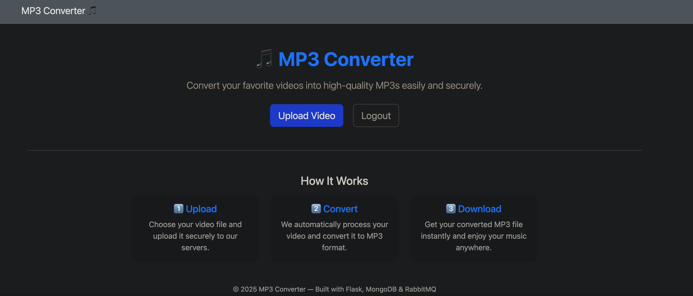
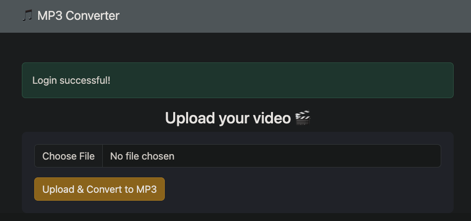
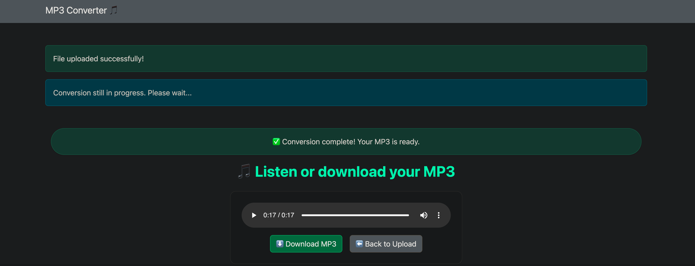

## Project Management – Trello Board

Track development progress, tasks, roadmap, and feature planning for this project:

---

# Overview

This project implements a microservices-based media conversion platform written in Python.
The system is built around independent services for authentication, media conversion, message brokering, and monitoring.
It enables authenticated users to upload video files, process them asynchronously via RabbitMQ, and download converted MP3 files once the conversion is complete.

## Technologies

Python (Flask, Pika, GridFS, PyMongo)

MongoDB (GridFS for binary storage)

RabbitMQ (message broker)

Docker / Kubernetes (Minikube) (container orchestration)

ELK Stack (Elasticsearch, Logstash/Filebeat, Kibana for monitoring)

JWT Authentication (via auth service)

Logging (structured logs from all services centralized in Elasticsearch)

## Photos

Home Page

Upload Page

Download Page
